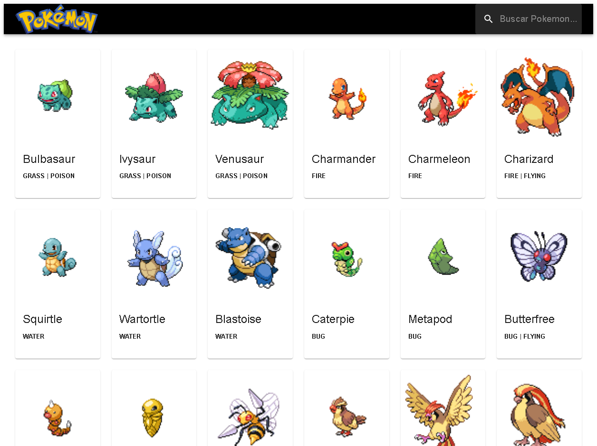

    

-------
Projeto desenvolvido para praticar as habilidades com React, Material UI e a utilização de Axios com a integração da API do PokeAPI

## 💻 Tecnologias
- React
- Material UI
- Axios 

## 💬 Aplicações

- React
    - Hooks
    - Imutabilidade
    - Reutilização de Componentes
    
- Material UI
    - Cards
    - Navbar
    - Skeleton
    - Container
    
